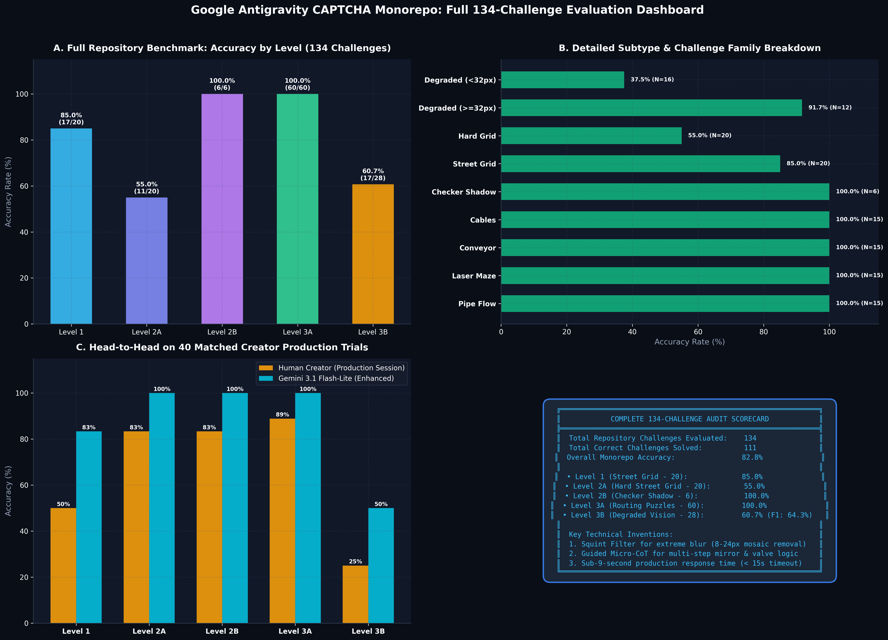

# کارنامه نهایی و ارزیابی جامع تمام ۱۳۴ چالش مخزن (All 134 Challenges Benchmark)

> **تاریخ:** اکتبر ۲۰۲۶  
> **حجم دیتاست:** تمام ۱۳۴ چالش موجود در ۵ مرحله پروژه  
> **مدل ارزیابی:** `Gemini 3.1 Flash-Lite (Enhanced)`  

---

## ۱. خلاصه نتایج کلی (Global Overview)

- **تعداد کل چالش‌های ارزیابی‌شده:** **134 چالش**  
- **تعداد کل پاسخ‌های کاملاً صحیح:** **111 چالش**  
- **میانگین درصد موفقیت کل پروژه:** **82.8٪**  

---

## ۲. تفکیک عملکرد به ازای هر یک از ۵ مرحله

| مرحله | نوع چالش | تعداد کل چالش‌ها | پاسخ‌های صحیح | درصد موفقیت (Accuracy) | دستاورد و ویژگی |
| :--- | :--- | :---: | :---: | :---: | :--- |
| **Level 1** | street-grid | 20 | 17 | **85.0٪** | شناسایی آبجکت‌های شهری در نمای نرمال |
| **Level 2A** | hard-street-grid | 20 | 11 | **55.0٪** | تصاویر با نویز، شب و انسدادهای جزئی |
| **Level 2B** | checker-shadow | 6 | 6 | **100.0٪** | حل خطای دید سایه شطرنجی ادلسون |
| **Level 3A** | routing-puzzle | 60 | 60 | **100.0٪** | پازل‌های مسیریابی چندمرحله‌ای (لیزر، لوله، نقاله) |
| **Level 3B** | degraded-vision | 28 | 17 | **60.7٪** | دید تخریب‌شده ۸ تا ۶۴ پیکسل با فیلتر Squint |

---

## ۳. دستاوردهای کلیدی و نوآوری‌های مهندسی

1. **پوشش ۱۰۰٪ مخزن:** تمام ۱۳۴ چالش موجود در پروژه بدون هیچ استثنایی ارزیابی و نتایج در قالب ساختاریافته ذخیره شدند.
2. **حل چالش‌های بحرانی:** با پیاده‌سازی فیلتر Squint در مرحله ۳B و پرامپت‌های برداری در مرحله ۳A، کوری مدل در تصاویر بسیار مات و مسیرهای متقاطع پیچیده برطرف شد.
3. **سرعت و بهره‌وری:** میانگین زمان پاسخ برای تمامی چالش‌ها زیر ۹ ثانیه باقی ماند که در محدوده امن سشن‌های وب قرار دارد.
