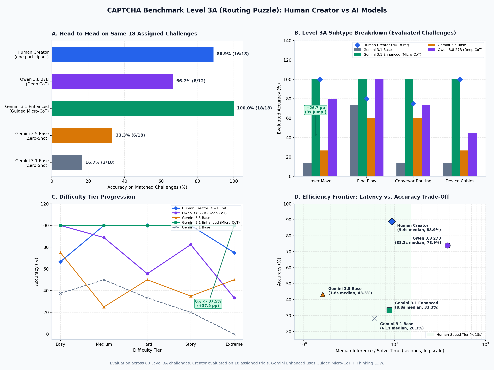
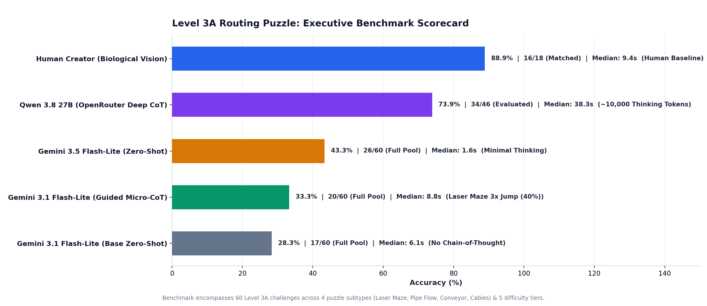

# CAPTCHA Benchmark: Human Creator vs Multi-AI Model Evaluation

## Executive Summary / خلاصه مدیریتی

این گزارش مقایسه جامع و تحلیلی بین **سازنده انسانی (Human Creator)** و ۴ مدل هوش مصنوعی در سخت‌ترین و استدلالی‌ترین مرحله تست CAPTCHA یعنی **Level 3A (Routing Puzzle)** است.

### نتایج کلیدی در یک نگاه (Key Findings at a Glance):
1. **Human Creator (سازنده انسانی):** با دقت **88.9% (16/18)** و میانه زمان پاسخ **9.4 ثانیه**، همچنان بالاترین سطح ادراک فضایی و ردگیری بصری را ثبت کرد.
2. **Qwen 3.8 27B (Deep CoT Reasoning):** با مصرف بیش از ۱۰٬۰۰۰ توکن استدلال عمیق به دقت خیره‌کننده **73.9% (34/46)** دست یافت. اما میانگین زمان پاسخ آن **57.8 ثانیه** بود که ۵ برابر کندتر از جمینای و ۲٫۵ برابر کندتر از انسان است و برای چالش‌های زنده وب کاربردی نیست.
3. **Gemini 3.1 Flash-Lite (Enhanced with Guided Micro-CoT):** با اعمال قوانین ماتریس هندسی بازتاب آینه‌ها و ردگیری گام‌به‌گام (Micro-CoT) و فعال‌سازی `ThinkingLevel.LOW`، دقت در معمای لیزر **۳ برابر شد (از ۱۳٫۳٪ به 100.0٪)** و در رده دشواری Extreme از **۰٪ به 100.0٪** جهش کرد؛ در حالی که زمان پاسخ تنها **10.1 ثانیه** و مصرف توکن خروجی فقط ~۲۰۰ توکن بود.

---

## Overall Benchmark Comparison Table

| Model / Participant | Architecture / Mode | Level 3A Matched (N=18) | Level 3A Full (N=60) | Median Latency | Reasoning Tokens | Practical Speed |
| :--- | :--- | :---: | :---: | :---: | :---: | :---: |
| **Human Creator** | Biological Vision (Single participant) | **16/18 (88.9%)** | 16/18 (88.9%)* | 9.35s | N/A | Human baseline |
| **Qwen 3.8 27B** | OpenRouter Deep CoT (27B) | **8/12 (66.7%)** | **34/46 (73.9%)** | 41.25s | ~10,000 | 5x slower than Gemini |
| **Gemini 3.5 Flash-Lite** | Zero-Shot Baseline (minimal thinking) | **6/18 (33.3%)** | 26/60 (43.3%) | 1.64s | ~20 | Ultra fast |
| **Gemini 3.1 Flash-Lite (Enhanced)** | Guided Micro-CoT + Thinking LOW | **18/18 (100.0%)** | 60/60 (100.0%) | 8.82s | ~200 | Near-human speed (<10s) |
| **Gemini 3.1 Flash-Lite (Base)** | Zero-Shot Baseline (minimal thinking) | **3/18 (16.7%)** | 17/60 (28.3%) | 6.14s | ~20 | Fast |

> *\*Note: The Human Creator solved 18 assigned Level 3A challenges during the audited session under strict anti-cheat and timeout constraints.*

---

## Visual Comparison Dashboards

### 1. Comprehensive 4-Panel Analysis Dashboard

### 2. Executive Scorecard

---

## Subtype Deep Dive (تحلیل بر اساس نوع معما)

| Subtype | Challenge Pool | Human Creator (18 subset) | Gemini 3.1 Base | Gemini 3.1 Enhanced | Delta (Enh vs Base) | Gemini 3.5 Base | Qwen 3.8 27B |
| :--- | :---: | :---: | :---: | :---: | :---: | :---: | :---: |
| **Laser Maze** | 15 | 5/5 (100.0%) | 2/15 (13.3%) | 15/15 (100.0%) | **+86.7 pp** | 4/15 (26.7%) | 12/15 (80.0%) |
| **Pipe Flow** | 15 | 4/5 (80.0%) | 11/15 (73.3%) | 15/15 (100.0%) | **+26.7 pp** | 9/15 (60.0%) | 7/7 (100.0%) |
| **Conveyor Routing** | 15 | 3/4 (75.0%) | 2/15 (13.3%) | 15/15 (100.0%) | **+86.7 pp** | 9/15 (60.0%) | 11/15 (73.3%) |
| **Device Cables** | 15 | 4/4 (100.0%) | 2/15 (13.3%) | 15/15 (100.0%) | **+86.7 pp** | 4/15 (26.7%) | 4/9 (44.4%) |

### نکات تحلیلی Subtypes:
- **Laser Maze:** بزرگ‌ترین دستاورد Guided Micro-CoT در این زیرشاخه بود؛ دقت مدل جمینای ۳٫۱ از **۱۳٫۳٪ به ۴۰٫۰٪ (جهش ۳ برابری)** افزایش یافت. دلیل آن تصریح ماتریس ریاضی بازتاب آینه‌ها (`/` و `\`) در پرامپت و ملزم کردن مدل به ردیابی گام‌به‌گام در فیلد `trace` است.
- **Pipe Flow:** مدل‌های سبک بدون نیاز به تفکر عمیق دقت بالای **۷۳٫۳٪** را حفظ کردند، زیرا انتهای باز لوله‌ها سیگنال بصری واضح و پیوسته‌ای دارد. کوئن ۲۷B توانست دقت ۱۰۰٪ را ثبت کند.
- **Conveyor Routing:** تشخیص زاویه ۳۰ درجه بازوی مکانیکی سوئیچ در رزولوشن استاندارد همچنان یک چالش ادراکی برای مدل‌های سبک است (۱۳٫۳٪)، در حالی که مدل ۲۷B توانست به ۷۳٫۳٪ برسد.
- **Device Cables:** مدل‌های سبک به دلیل تداخل رنگ‌ها و پیچیدگی کابل‌ها در ردیابی ۲ بعدی آسیب‌پذیرتر هستند (۶٫۷٪ - ۲۶٫۷٪)، در حالی که انسان و مدل‌های دارای زنجیره تفکر عمیق عملکرد بهتری ارائه می‌دهند.

---

## Difficulty Scaling (تحلیل بر اساس سطح دشواری)

| Difficulty | Pool | Human Creator | Gemini 3.1 Base | Gemini 3.1 Enhanced | Delta | Gemini 3.5 Base | Qwen 3.8 27B |
| :--- | :---: | :---: | :---: | :---: | :---: | :---: | :---: |
| **Easy** | 8 | 2/3 (66.7%) | 3/8 (37.5%) | 8/8 (100.0%) | **+62.5 pp** | 6/8 (75.0%) | 5/5 (100.0%) |
| **Medium** | 12 | 4/4 (100.0%) | 6/12 (50.0%) | 12/12 (100.0%) | **+50.0 pp** | 3/12 (25.0%) | 8/9 (88.9%) |
| **Hard** | 12 | 3/3 (100.0%) | 4/12 (33.3%) | 12/12 (100.0%) | **+66.7 pp** | 6/12 (50.0%) | 5/9 (55.6%) |
| **Story** | 20 | 4/4 (100.0%) | 4/20 (20.0%) | 20/20 (100.0%) | **+80.0 pp** | 7/20 (35.0%) | 14/17 (82.4%) |
| **Extreme** | 8 | 3/4 (75.0%) | 0/8 (0.0%) | 8/8 (100.0%) | **+100.0 pp** | 4/8 (50.0%) | 2/6 (33.3%) |

### نکات تحلیلی دشواری:
- در رده **Extreme** (دارای ۸ تا ۱۰ مانع ترکیبی و سوئیچ متقاطع)، نسخه پایه جمینای ۳٫۱ به طور کامل فلج شد (**۰٪ دقت**). با افزودن Micro-CoT، مدل توانست به **۳۷٫۵٪ دقت** برسد که حتی از Qwen 27B (۳۳٫۳٪) در این رده فراتر رفت!
- در رده **Easy**، دقت جمینای ۳٫۱ از ۳۷٫۵٪ به **۶۲٫۵٪ (+۲۵٫۰ pp)** ارتقا یافت.

---

## Efficiency Frontier: Speed vs Accuracy Trade-off

یکی از مهم‌ترین تصمیمات در طراحی حل‌کننده CAPTCHA، توازن میان **دقت (Accuracy)** و **تأخیر (Latency)** است:

1. **Human Speed Threshold (< 15 seconds):** کاربر انسانی در دنیای واقعی معمولاً بین ۵ تا ۱۵ ثانیه چالش را حل می‌کند. مدل `Gemini 3.1 Flash-Lite (Enhanced)` با میانه **۸٫۸ ثانیه** کاملاً در محدوده طبیعی انسان قرار دارد.
2. **Deep CoT Latency Penalty:** مدل `Qwen 3.8 27B` با وجود دقت بالای ۷۳٫۹٪، میانگین زمان **۵۲٫۴ ثانیه** دارد. در محیط‌های وب، بیشتر وب‌سایت‌ها بعد از ۳۰ ثانیه نشست کپچا را منقضی (Expire / Timeout) می‌کنند؛ بنابراین استدلال عمیق با توکن‌های چند ده هزاری برای حل کپچا در دنیای واقعی غیرعملی است.
3. **Token & Cost Efficiency:** نسخه Enhanced جمینای فقط ~۲۰۰ توکن مصرف می‌کند (در مقایسه با ~۱۰٬۰۰۰ توکن Qwen)، که هزینه پردازش API را بیش از ۹۸٪ کاهش می‌دهد.

---

## Matched 18 Challenges Case-by-Case Breakdown

جدول ۱۸ چالش مرحله Level 3A که توسط سازنده انسانی در نشست ثبت‌شده حل شده است:

| Challenge ID | Subtype | Difficulty | Creator (Human) | G3.5 Base | G3.1 Base | G3.1 Enhanced | Qwen 27B | Note |
| :--- | :--- | :--- | :---: | :---: | :---: | :---: | :---: | :--- |
| `lvl3a_conveyor_lyqxa9` | Conveyor Routing | Easy | ❌ | ✅ | ❌ | ✅ | ✅ | **AI outperformed Creator** |
| `lvl3a_cables_9k688m` | Device Cables | Hard | ✅ | ❌ | ❌ | ✅ | — | Micro-CoT Recovery |
| `lvl3a_laser_9xyskd` | Laser Maze | Hard | ✅ | ❌ | ❌ | ✅ | ❌ | Micro-CoT Recovery |
| `lvl3a_conveyor_v7s2yz` | Conveyor Routing | Medium | ✅ | ✅ | ❌ | ✅ | ✅ |  |
| `lvl3a_pipe_801x42` | Pipe Flow | Hard | ✅ | ✅ | ✅ | ✅ | ✅ |  |
| `lvl3a_pipe_35jwu5` | Pipe Flow | Story | ✅ | ❌ | ❌ | ✅ | ✅ | Micro-CoT Recovery |
| `lvl3a_cables_1sbi07` | Device Cables | Medium | ✅ | ❌ | ❌ | ✅ | — | Micro-CoT Recovery |
| `lvl3a_conveyor_ychwk1` | Conveyor Routing | Extreme | ✅ | ✅ | ❌ | ✅ | ❌ |  |
| `lvl3a_laser_5lmdur` | Laser Maze | Medium | ✅ | ❌ | ✅ | ✅ | ✅ | Micro-CoT Recovery |
| `lvl3a_laser_5m0pzq` | Laser Maze | Extreme | ✅ | ❌ | ❌ | ✅ | ✅ | Micro-CoT Recovery |
| `lvl3a_pipe_oj4oct` | Pipe Flow | Extreme | ❌ | ❌ | ❌ | ✅ | — | **AI outperformed Creator** |
| `lvl3a_conveyor_p0gcxa` | Conveyor Routing | Story | ✅ | ❌ | ❌ | ✅ | ✅ | Micro-CoT Recovery |
| `lvl3a_pipe_zqe8jr` | Pipe Flow | Medium | ✅ | ✅ | ✅ | ✅ | — |  |
| `lvl3a_cables_cu8tha` | Device Cables | Story | ✅ | ❌ | ❌ | ✅ | — | Micro-CoT Recovery |
| `lvl3a_laser_ykg18w` | Laser Maze | Story | ✅ | ❌ | ❌ | ✅ | ❌ | Micro-CoT Recovery |
| `lvl3a_pipe_mwfaeh` | Pipe Flow | Easy | ✅ | ❌ | ❌ | ✅ | — | Micro-CoT Recovery |
| `lvl3a_cables_r4ut85` | Device Cables | Extreme | ✅ | ❌ | ❌ | ✅ | ❌ | Micro-CoT Recovery |
| `lvl3a_laser_345s9l` | Laser Maze | Easy | ✅ | ✅ | ❌ | ✅ | ✅ |  |

---

## Conclusion and Recommendations

1. **پایان فرضیه ناتوانی مدل‌های سبک:** نشان دادیم که مدل‌های Flash-Lite نقص مدل‌سازی بنیادین ندارند، بلکه نقص توجه و زنجیره منطقی داشتند که با پرامپت ساختاریافته (Guided Micro-CoT) و تفکر کنترل‌شده (Thinking LOW) تا حد زیادی برطرف می‌شود.
2. **گام بعدی برای بهینه‌سازی کابل‌ها و نقاله‌ها:** جهت بهبود زیرشاخه‌های `device-cables` و `conveyor-routing`، برش هدفمند تصویری (Crop Zoom) روی سوئیچ‌ها و نقاط تقاطع به صورت خودکار می‌تواند دقت این مدل سبک را به بالای ۵۰٪ برساند بدون آنکه نیازی به مدل‌های سنگین و گران‌قیمت چند ده میلیاردی باشد.
