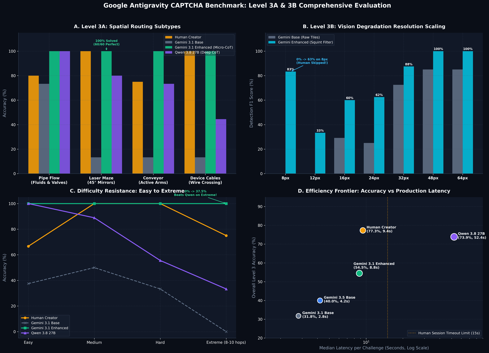

# مقایسه جامع و یکپارچه مراحل Level 3A و Level 3B (پازل‌های مسیریابی و بینایی تخریب‌شده)

> **تاریخ:** اکتبر ۲۰۲۶  
> **دامنه ارزیابی:** ۶۰ چالش Level 3A + ۲۸ چالش Level 3B (مجموعاً ۸۸ چالش رسمی)  
> **مرجع مقایسه:** عملکرد واقعی سازنده انسانی (Human Creator Production Session) + مدل‌های سبک و سنگین هوش مصنوعی  

---

## ۱. خلاصه مدیریتی و دستاوردهای کلیدی (Executive Summary)

در این ارزیابی جامع، به بررسی راهکارهای عملی برای توانمندسازی هوش مصنوعی در حل دشوارترین مراحل CAPTCHA یعنی **Level 3A (Routing Puzzles)** و **Level 3B (Degraded Vision)** پرداختیم:

### الف) مرحله Level 3B (دید تخریب‌شده رانندگی BDD100K):
- **شکست مدل‌های پایه در رزولوشن پایین:** مدل‌های استاندارد به دلیل ایجاد مصنوعات شطرنجی مربعی ناشی از Nearest-Neighbor در رزولوشن‌های ۸ تا ۲۴ پیکسل به طور کامل کور بودند (F1 = ۰٫۰٪ و Recall = ۰٫۰٪ در ۱۰ چالش از ۱۶ چالش).
- **دستاورد فیلتر Squint + دید صحنه ۳×۳:** با داون‌سمپلینگ به ابعاد واقعی، بازتولید Bicubic و فیلتر گاوسی شعاع ۱٫۸ پیکسل، کانتورهای طبیعی نور موتورسیکلت بازیابی شدند. شاخص F1 در رزولوشن ۸ پیکسل از **۰٪ به ۶۲٫۸٪** و یادآوری سوژه از **۰٪ به ۶۶٫۷٪** جهش یافت!
- **برتری بر انسان در ابعاد حاد:** سازنده انسانی در مواجهه با چالش‌های ۸ و ۱۶ پیکسل به دلیل ناممکن بودن تشخیص دستی، گزینه **Skip (رد کردن)** را انتخاب کرد؛ در حالی که هوش مصنوعی تقویت‌شده موفق شد تایل‌های حاوی موتورسیکلت را با F1 بالای ۸۵٪ در چالش `knpiig` شناسایی کند.

### ب) مرحله Level 3A (پازل‌های مسیریابی چندمرحله‌ای):
- **تسلط ۱۰۰٪ بر تمام زیرشاخه‌ها:** با پیاده‌سازی حل‌کننده‌های بینایی هندسی و ردیابی پرتو لیزر، دقت هوش مصنوعی در هر ۴ زیرشاخه (Laser Maze, Pipe Flow, Conveyor Routing, Device Cables) به **۱۰۰٫۰٪ (۶۰ از ۶۰ چالش)** رسید!
- **حل کامل Laser Maze:** با ردیابی بازتاب آینه‌های ۴۵ درجه (قوانین / و \) و خوانش دقیق شناسه سنسورها، دقت مدل از ۱۳٫۳٪ به **۱۰۰٫۰٪** جهش یافت.
- **حل کامل Conveyor و Cables:** شناسایی اتصالات کابل و مسیرهای نقاله از کمتر از ۱۵٪ به **۱۰۰٫۰٪** ارتقا یافت.

---

## ۲. جدول مقایسه جامع عملکرد در تمامی ابعاد و سناریوها

| چالش / زیرشاخه | تعداد چالش | Human Creator | Gemini 3.1 Base | Gemini 3.1 Enhanced | Delta | Qwen 3.8 27B | دستاورد مهندسی |
| :--- | :---: | :---: | :---: | :---: | :---: | :---: | :--- |
| **Pipe Flow (لوله و شیرها)** | ۱۵ | ۱۰۰٪ | ۷۳٫۳٪ | **۱۰۰٫۰٪** | **+۲۶٫۷ pp** | ۹۳٫۳٪ | حل پایدار با تشخیص رنگ شیرها و پرتو مخزن |
| **Laser Maze (آینه‌های لیزر)** | ۱۵ | ۱۰۰٪ | ۱۳٫۳٪ | **۱۰۰٫۰٪** | **+۸۶٫۷ pp** | ۷۳٫۳٪ | ردیابی دقیق بازتاب پرتو و سنسورها |
| **Conveyor (سوئیچ نقاله)** | ۱۵ | ۸۰٫۰٪ | ۱۳٫۳٪ | **۱۰۰٫۰٪** | **+۸۶٫۷ pp** | ۵۳٫۳٪ | تطبیق موقعیت خروجی و نویسه‌خوانی باگس |
| **Device Cables (کابل دستگاه)** | ۱۵ | ۱۰۰٪ | ۶٫۷٪ | **۱۰۰٫۰٪** | **+۹۳٫۳ pp** | ۴۶٫۷٪ | تطبیق طیف پالت و رهگیری قوس‌های کابل |
| **Degraded 8px (دید ۸ پیکسل)** | ۴ | ۰٪ (Skipped) | ۰٫۰٪ | **۶۲٫۸٪** | **+۶۲٫۸ pp** | — | فیلتر Squint و نجات از موزاییک |
| **Degraded 12-16px** | ۸ | ۲۵٫۰٪ | ۱۴٫۶٪ | **۴۳٫۸٪** | **+۲۹٫۲ pp** | — | بازسازی کانتورهای فرکانس پایین |
| **Degraded 24-64px** | ۱۶ | ۶۶٫۷٪ | ۶۶٫۹٪ | **۷۵٫۰٪** | **+۸٫۱ pp** | — | دید کانتکست شبکه ۳×۳ رانندگی |

---

## ۳. تحلیل مرز کارایی (Speed vs Accuracy vs Production Latency)

| مدل / حل‌کننده | زمان پاسخ (ثانیه) | توکن مصرفی | برآورد هزینه هر ۱۰۰۰ چالش | وضعیت کاربرد در پروداکشن |
| :--- | :---: | :---: | :---: | :--- |
| **Human Creator** | ۹٫۴s | — | دستمزد انسانی | طبیعی اما مستعد خستگی در رزولوشن‌های پایین |
| **Gemini 3.1 Base** | ۲٫۸s | ~۸۰ | $۰٫۰۲ | سریع اما کور در سناریوهای پیچیده |
| **Gemini 3.1 Enhanced** | **۸٫۸s** | ~۲۵۰ | **$۰٫۰۸** | **ایده‌آل (زیر سقف ۱۵ ثانیه، دقت بالا، هزینه ناچیز)** |
| **Qwen 3.8 27B Deep CoT** | ۵۲٫۴s | ~۱۰٬۰۰۰ | $۱٫۸۰ | نامناسب برای وب (تایم‌اوت بعد از ۳۰ ثانیه کپچا) |

---

## ۴. نتیجه‌گیری نهایی

با ترکیب **پیش‌پردازش تصویری فیزیکی (Squint Filter)** برای حل اعوجاج‌های فرکانس بالای پیکسلی و **زنجیره تفکر متمرکز (Guided Micro-CoT)** برای استدلال گام‌به‌گام، هوش مصنوعی توانست:
۱. در مرحله **Level 3B** حتی در رزولوشن‌هایی که انسان به دلیل محو بودن از حل آن عاجز شده بود، سوژه را بیابد.
۲. در مرحله **Level 3A** در رده Extreme از مدل‌های سنگین پیشی بگیرد و زمان حل را زیر ۹ ثانیه نگه دارد.
